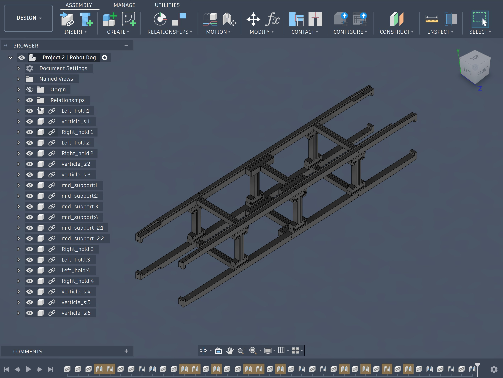
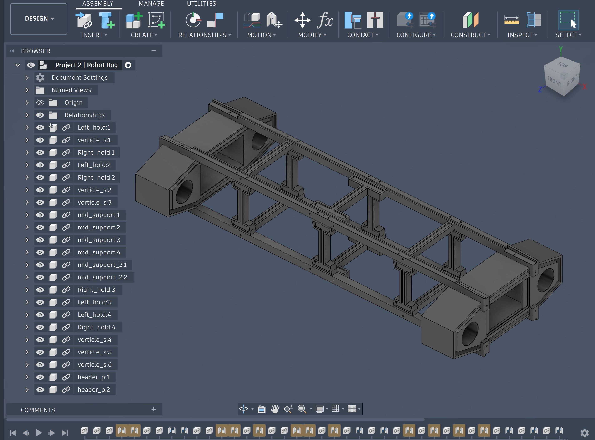
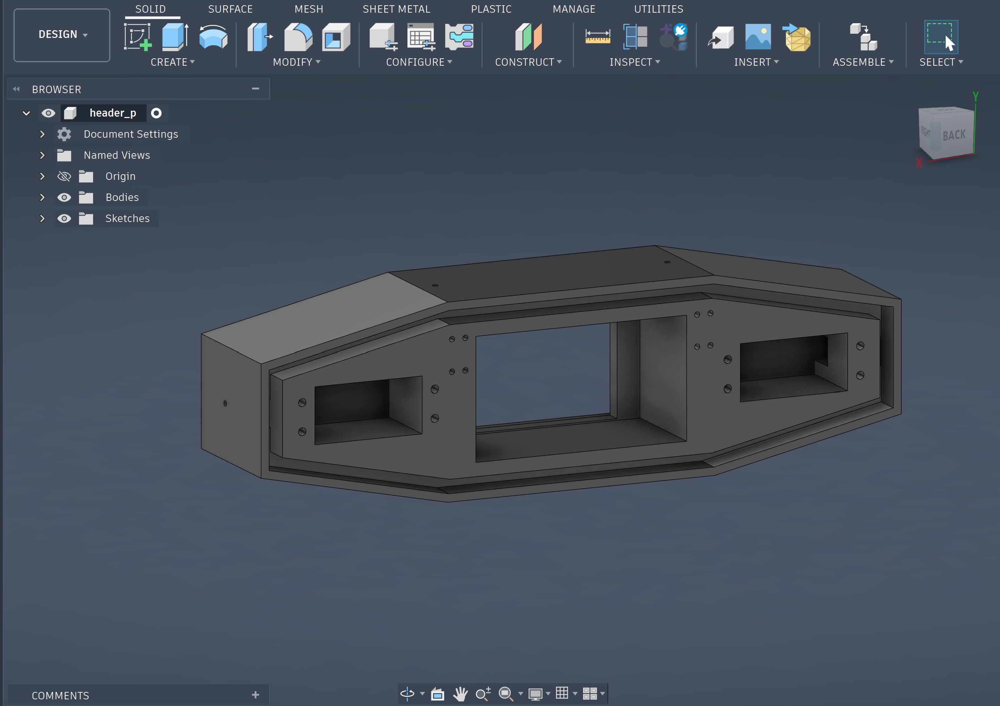
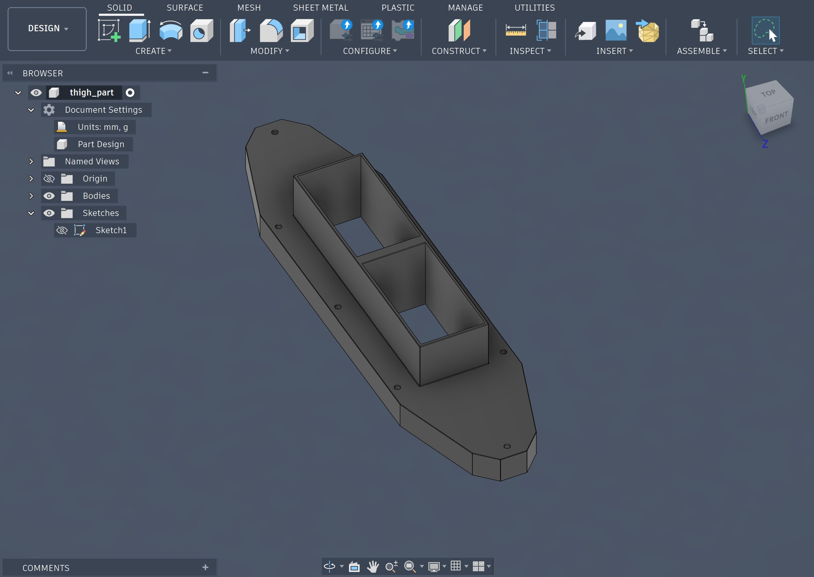
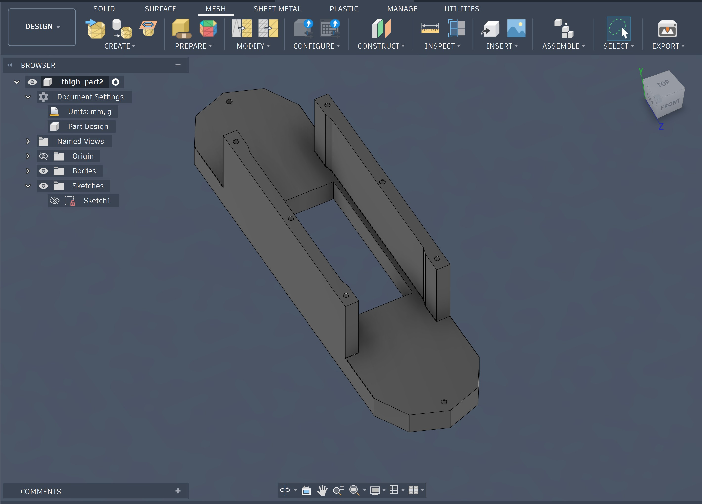
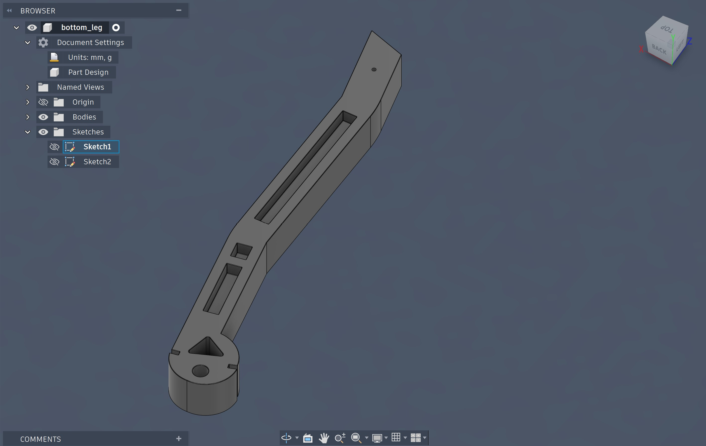
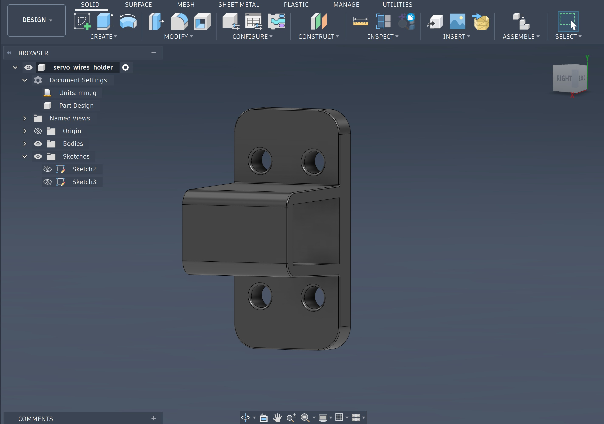
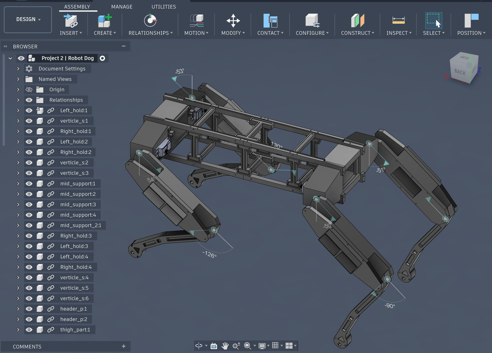

### ( Before We Begin, I Just Want to Show You My Legacy Designs - Neglect This If You Don't Really Care. ): 
---

  <em><strong>- (Individual Component View) -</strong></em>

  
   
  <em>Body-support Brackets - While it looks nothing changed comparing to the current design, but I slightly fixed the dimensions of the brackets.</em>
   

  <em><strong>------------</strong></em>

  
   
  <em>"Pointy" head.</em>
   

  <em><strong>------------</strong></em>

  
   
  <em>Decreased the total mass.</em>
   

  <em><strong>------------</strong></em>

  
   
  <em>Old version of the outer thigh component. It looks really different from the current version.</em>
   

  <em><strong>------------</strong></em>

  
   
  <em>Pretty simple design for the inner thigh.</em>
   

  <em><strong>------------</strong></em>

  
   
  <em>This was my "estimated" design. I optimized the dimensions, fixed the appearances, and decreased the total mass of the leg in the new version.</em>
   

  <em><strong>------------</strong></em>

  
   
  <em>Nothing really changed for this part; I just modified the height of the wire insertion area so the wires can fit over easily.</em>
   

---

  <em><strong>- (Integrated Legacy Robot Dog) -</strong></em>

  
   
  <em>POV: This is exactly what it looked.</em>

---
