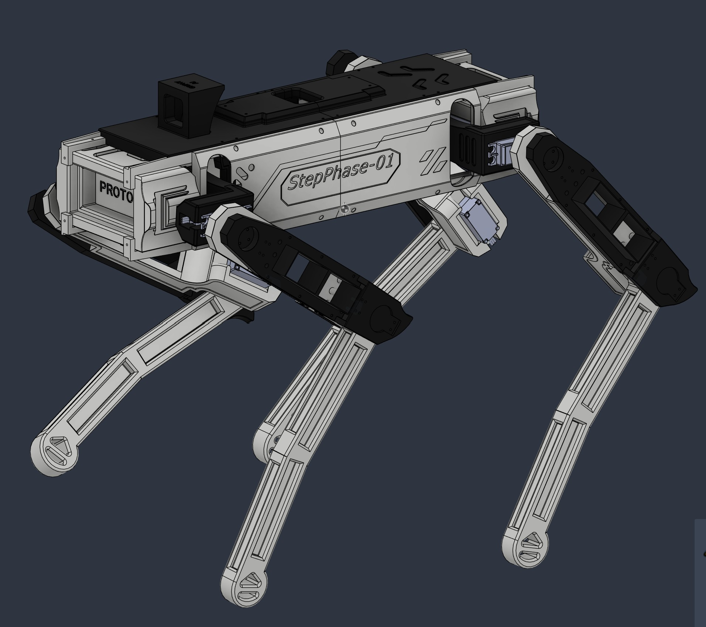

## ( QUADRUPLE ROBOT DOG - INSPIRED BY Unitree ): Open-Sourced ##

As you may have read the repository title, this is my FIRST an open-sourced robot dog project. If I have lacked any resources, please message me in Reddit **( https://www.reddit.com/user/Severe_Package6618/ - Display name is MiniGriphy )**

  
   
  <em>Reddit Account</em>

---

### ( Preface ):
In order for this project to work, I really recommend you using a 3D printer that has a dimension of 260 x 260 x 300 mm^3 (the one I'm using is Creality). If you don't have one, it's fine, just try to adjust the component on the printing platform **diagonally** until the part fits on the it perfectly without crossing the boundary. 

This project relies on 12 servos/motors, **DS3235 (a torque of 35kg/cm)**, you can purchase it from Amazon, AliExpress, or any websites that are completely safe. The reason why we need DS3235 is that we want a strong torque that would lift at least 1 kilogram (kg) of body weight. Even the servos can easily this weight, we also need to ensure that when adding electronics (e.g., batteries, cables, microcontroller, AI vision, etc), the DS3235 servos are still be able to lift them. 

And to extract the servos' full potential, we have to use 6.8 V - 7.4V (volts) 20A (or higher current) power supply or battery (note: this would add additional weight to the robot, and we need to be constantly cautious about the total weight while making this project.). Otherwise, if you have, let's say, a 5V 15A power supply, the servos won't be able to exert all its torque power, meaning it would be slightly tedious to conduct the heavy-lifting. 

---

### ( What Do We NEED for The Quadruple Robot Dog; resources requirements? ):
- **(Optional, but NOT recommended)**: A 6.8V - 7.4V 20A power supply or battery (FOR **BENCH-TESTING ONLY!** AND IT IS NOT RECOMMENDED IF YOU'RE USING A PCA9685 SERVO DRIVER. BECAUSE AS I HAVE MENTIONED ABOVE, THE COPPER TRACES ON ITS CIRCUIT WOULD BURN OR MELT IF THE SERVOS PULL OVER 10 AMPS AT A TIME.)

- ESP32 (Any standard ESP-32. I'm using Devkit v1)
- Raspberry Pi 2W
- LiPo Battery 2200mAh 7.4V 50C (with XT60 cable)
- UBEC Voltage Regulator (Note: Find the product that is able to decrease a **7.4V power to 6V**) 
- Hiwonder LSC-32 32-Channel Controller (Alternative: PCA9685 driver board can be acceptable if you have solutions to prevent current spike)
- 12 DS3235 Servos
- CAD parts/components (Robot Dog) - **You can access and download them through the 'RD_CAD_FILE' folder.**
- A camera for AI vision (Note: If you have a camera that is specialized for AI, that would be a perfect one as long as it does NOT connecting with USB cable.)
- 2M 6-25mm screws (Note: It is recommended to purchase a kit)
- Arduino IDE (C++)
- ROS2 (Robot Operating System) - **OPTIONAL** (note: please ignore this requirement if you don't know how to code ROS2 programs; it is optional for serial communications and nodes distribution)

---

## ( Building the Robot Dog By Using the CAD Parts ): 
I am pretty confident most of you knowing how to assemble this robot base on how it looks. If I am wrong, then please check the '**RD_Building_Instruction**' page. 

  
   
  <em>Reference RD View</em>

